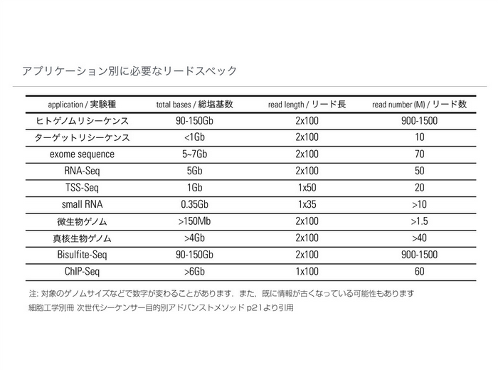
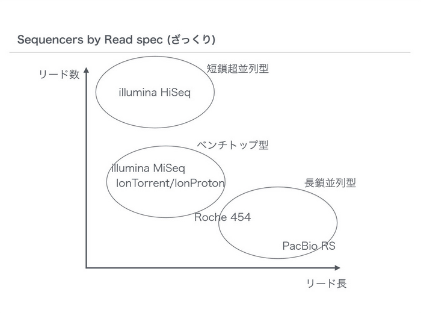
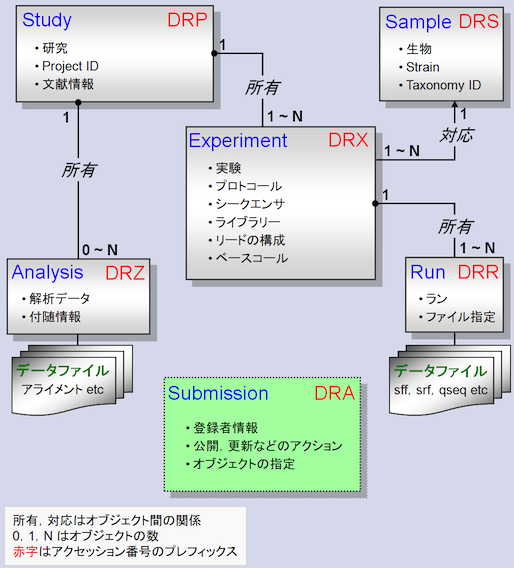
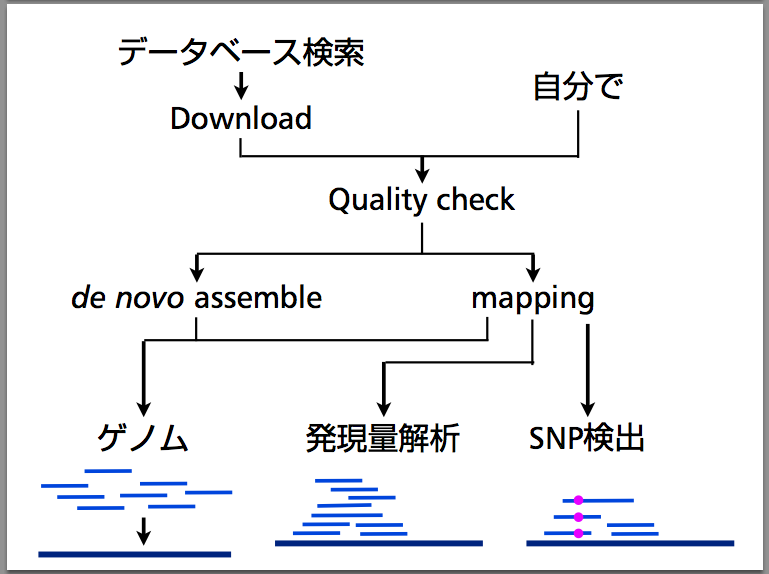

# 「次世代シーケンサー（NGS）と関連するデータベース・ツール」 担当：仲里 猛留

<h3 id="content_1_0"><a id="ua35d9f1" href="http://MotDB.DBCLS.jp/?AJACS48%2Fnakazato#ua35d9f1" title="ua35d9f1">_</a> おことわり  </h3>
<ul class="list1" style="padding-left:16px;margin-left:16px"><li>次世代シーケンシングデータのコマンドラインによる解析は今日は演習はやりません。
<ul class="list2" style="padding-left:16px;margin-left:16px"><li>∵ 時間がない。マシンパワーとディスク容量が必要なため。データの転送に膨大な時間がかかるため。目的別に解析の方法が違う</li></ul></li>
<li>時間があれば紙芝居（あるいは3分クッキング方式）でお見せします</li>
<li>↓ かわりに参考サイト</li></ul>

<h3 id="content_1_1"><a id="o4ea348c" href="http://MotDB.DBCLS.jp/?AJACS48%2Fnakazato#o4ea348c" title="o4ea348c">_</a> 参考  </h3>
<ul class="list1" style="padding-left:16px;margin-left:16px"><li><a href="http://www.iu.a.u-tokyo.ac.jp/~kadota/r_seq.html" rel="nofollow">(Rで)塩基配列解析（主に次世代シーケンサーのデータ）</a>（門田幸二さん：東京大学 大学院農学生命科学研究科 アグリバイオインフォマティクス教育研究ユニット）</li>
<li><a href="http://www.ipad-zine.com/b/1520" rel="nofollow">お家でできるMac Bookでやる次世代シーケンスデータ解析</a> （PDFへのリンク）（緒方法親さん：東京農工大学 応用昆虫学研究室（当時））</li>
<li>統合TV：<a href="http://togotv.dbcls.jp/20120925.html#p01" rel="nofollow">R+Bioconductorを使ったNGS解析1</a>（二階堂愛さん：理化学研究所 発生・再生科学総合研究センター（当時））</li>
<li>統合TV：<a href="http://togotv.dbcls.jp/20120926.html#p01" rel="nofollow">R+Bioconductorを使ったNGS解析2</a>（二階堂愛さん：理化学研究所 発生・再生科学総合研究センター（当時））</li>
<li>統合TV：<a href="http://togotv.dbcls.jp/20110803.html#p01" rel="nofollow">Avadis NGS の使い方～導入編～</a> … 商用ソフト</li>
<li>統合TV：<a href="http://togotv.dbcls.jp/20111124.html#p01" rel="nofollow">Avadis NGS の使い方～RNA-seq編～</a> … 商用ソフト</li>
<li>統合TV：<a href="http://togotv.dbcls.jp/20110528.html#p01" rel="nofollow">CLC Workbench シリーズの使い方～導入方法編～</a> … 別の商用ソフト</li>
<li>（参考）統合TV：<a href="http://togotv.dbcls.jp/20110627.html#p01" rel="nofollow">CLC Workbench シリーズの使い方 ～基本操作編～</a> … 別の商用ソフト</li>
<li>統合TV：<a href="http://togotv.dbcls.jp/20110628.html#p01" rel="nofollow">CLC Genomics Workbench でショートリードのマッピングを行う</a> … 別の商用ソフト</li>
<li>9月に「バイオインフォマティクス人材育成カリキュラム（次世代シークエンサ）速習コース」として、より実践的な講習会が開かれます。基本的に内容は公開されますので、その内容も参考にしてください： <a href="https://hpci.cbrc.jp/modules/tutorial/NBDC2014.html" rel="nofollow">https://hpci.cbrc.jp/modules/tutorial/NBDC2014.html</a></li></ul>

<h3 id="content_1_2"><a id="s241ae5b" href="http://MotDB.DBCLS.jp/?AJACS48%2Fnakazato#s241ae5b" title="s241ae5b">_</a> 次世代シーケンサ（とそのデータ）基礎知識  </h3>
<ul class="list1" style="padding-left:16px;margin-left:16px"><li>言葉
<ul class="list2" style="padding-left:16px;margin-left:16px"><li>次世代シーケンサ</li>
<li>次世代シーケンサー</li>
<li>新型シーケンサ</li>
<li>New-generation Sequencing (NGS)</li>
<li>Next-generation Sequiencing (NGS)</li>
<li>他にmassively parallel DNA sequencing とか...</li>
<li>最近は、 High-throughput DNA sequencing (technology) をよく使う印象（略語はNGS）</li></ul></li></ul>

<h3 id="content_1_3"><a id="w9846015" href="http://MotDB.DBCLS.jp/?AJACS48%2Fnakazato#w9846015" title="w9846015">_</a> 何が新型／次世代なのか?  </h3>
<ul class="list1" style="padding-left:16px;margin-left:16px"><li>90年代
<ul class="list2" style="padding-left:16px;margin-left:16px"><li>ゲル板</li>
<li>ポリアクリルアミドゲル電気泳動 + 蛍光標識ダイデオキシヌクレオチド

<a href="http://bunseiserver.pharm.hokudai.ac.jp/gihou/sequence.html" rel="nofollow">DNAシーケンス解析（北大・薬・分子生物）より</a></li>
<li><a href="http://ja.wikipedia.org/wiki/DNA%E3%82%B7%E3%83%BC%E3%82%AF%E3%82%A8%E3%83%B3%E3%82%B7%E3%83%B3%E3%82%B0#.E6.A4.9C.E5.87.BA" rel="nofollow">DNAシークエンシング - Wikipedia -- 検出</a>も参照</li></ul></li></ul>
<ul class="list1" style="padding-left:16px;margin-left:16px"><li>00年代
<ul class="list2" style="padding-left:16px;margin-left:16px"><li>キャピラリ

<a href="http://www.appliedbiosystems.jp/website/jp/product/modelpage.jsp?MODELCD=50768&amp;MODELPGCD=66447" rel="nofollow">ABI PRISM&#174; 3100-Avant Genetic Analyzerより</a></li></ul></li></ul>
<ul class="list1" style="padding-left:16px;margin-left:16px"><li>10年代
<ul class="list2" style="padding-left:16px;margin-left:16px"><li>NGSの登場</li>
<li>Sanger法（dideoxy法）→ パイロシーケンシング</li>
<li>（参考）<a href="http://www.youtube.com/watch?v=l99aKKHcxC4" rel="nofollow">原理の動画 (Illumina)</a>

<a href="http://www.hssnet.co.jp/2/2_3_10_1.html" rel="nofollow">次世代シーケンス解析サービス：概要・原理 | 北海道システム・サイエンス株式会社</a>より</li>
<li>ようするに顕微鏡＋インターバル撮影／タイムラプス撮影
<ul class="list3" style="padding-left:16px;margin-left:16px"><li>インターバル撮影／タイムラプス撮影： <a href="http://www.youtube.com/watch?v=1Az1YX3GgDw" rel="nofollow">http://www.youtube.com/watch?v=1Az1YX3GgDw</a></li></ul></li>
<li>超並列</li>
<li>どんなの?
<ul class="list3" style="padding-left:16px;margin-left:16px"><li>Illumina HiSeq<a href="http://MotDB.DBCLS.jp/?cmd=edit&amp;page=HiSeq&amp;refer=AJACS48%2Fnakazato">?</a>

</li>
<li>Illumina MiSeq<a href="http://MotDB.DBCLS.jp/?cmd=edit&amp;page=MiSeq&amp;refer=AJACS48%2Fnakazato">?</a>

</li>
<li>Ion Torrent</li>
<li>PacBio<a href="http://MotDB.DBCLS.jp/?cmd=edit&amp;page=PacBio&amp;refer=AJACS48%2Fnakazato">?</a></li>
<li>Togo picture gallery ( <a href="http://g86.dbcls.jp/~togoriv/" rel="nofollow">http://g86.dbcls.jp/~togoriv/</a> ) より

&#169; 2011 DBCLS Licensed under CC 表示 2.1 日本
←クレジットをいれれば、転載・改変・再利用 OK</li></ul></li></ul></li></ul>

<h3 id="content_1_4"><a id="ied6b37f" href="http://MotDB.DBCLS.jp/?AJACS48%2Fnakazato#ied6b37f" title="ied6b37f">_</a> NGSデータの規模  </h3>
<ul class="list1" style="padding-left:16px;margin-left:16px"><li>【実習】どのくらいのデータ量になるか考えてみましょう
<ul class="list2" style="padding-left:16px;margin-left:16px"><li>ゲル板：750 (base/lane) × 48/4 lanes

←こたえはここをクリック

9kbase

</li>
<li>キャピラリ：500 (base/lane) × 96 lane&#160;

←こたえはここをクリック

48kbase

</li>
<li>次世代： 36 (base/seq) × 300M seq/run

←こたえはここをクリック

10.8Gbase = 10,800,000kbase

</li>
<li>↑これらの数字は規模感をつかむだけなので、ざっくりな数字になっています（1 runにかかる時間は比較してないですし）</li>
<li>↑これらの数字は「塩基数」であって、シーケンサの出力である「画像データ」のデータサイズでないことに注意！</li>
<li>そして、その画像データはSRAには登録されていない</li></ul></li>
<li>[参考] 各シーケンサの性能比較
<ul class="list2" style="padding-left:16px;margin-left:16px"><li><a href="http://bit.ly/ngsspecbydritoshi" rel="nofollow">http://bit.ly/ngsspecbydritoshi</a> （二階堂さん@理研）</li>
<li><a href="http://dbcls.rois.ac.jp/~kawano/ng.html" rel="nofollow">http://dbcls.rois.ac.jp/~kawano/ng.html</a> （河野さん@DBCLS）</li></ul></li></ul>

<h3 id="content_1_5"><a id="ube61b34" href="http://MotDB.DBCLS.jp/?AJACS48%2Fnakazato#ube61b34" title="ube61b34">_</a> NGSの利用範囲  </h3>
<ul class="list1" style="padding-left:16px;margin-left:16px"><li>ゲノム、発現解析、メタゲノム解析、ChIP-Seq（転写因子解析）、SNP解析、...
<ul class="list2" style="padding-left:16px;margin-left:16px"><li>目的によって必要なデータ量も違う

</li>
<li>機器に合った利用を

</li></ul></li></ul>

<h3 id="content_1_6"><a id="wbd5dcb9" href="http://MotDB.DBCLS.jp/?AJACS48%2Fnakazato#wbd5dcb9" title="wbd5dcb9">_</a> NGS関連データベース  </h3>

<h3 id="content_1_7"><a id="i96f1863" href="http://MotDB.DBCLS.jp/?AJACS48%2Fnakazato#i96f1863" title="i96f1863">_</a> SRAとは  </h3>
<ul class="list1" style="padding-left:16px;margin-left:16px"><li>NGSのデータのレポジトリサイトです</li>
<li>SRA = Sequence Read Archive
<ul class="list2" style="padding-left:16px;margin-left:16px"><li>昔は「Short Read Archive」だったが、shortでなくなってきたので</li></ul></li>
<li>誰（どこ）が集めているのか?
<ul class="list2" style="padding-left:16px;margin-left:16px"><li>NCBI（米）: <a href="http://trace.ncbi.nlm.nih.gov/Traces/sra/sra.cgi?" rel="nofollow">SRA</a></li>
<li>EBI（欧）: <a href="http://www.ebi.ac.uk/ena/home" rel="nofollow">ENA</a> (European Nucleotide Archive)</li>
<li>DDBJ（日）: <a href="http://trace.ddbj.nig.ac.jp/dra/index.shtml" rel="nofollow">DRA</a> (DDBJ Sequnece Read Archive)</li>
<li>3局でデータの交換をしている
<ul class="list3" style="padding-left:16px;margin-left:16px"><li>DDBJを見に行ったとして、入っているのは日本だけ、ということはない、ということです。</li>
<li>個人情報にからむものは、実際の配列データはしかるべきところにしかない。本日最後のセッション参照。</li></ul></li></ul></li></ul>

<h3 id="content_1_8"><a id="s29619b3" href="http://MotDB.DBCLS.jp/?AJACS48%2Fnakazato#s29619b3" title="s29619b3">_</a> NCBI SRAやめます事件(11/2/16 現地時間)  </h3>
<ul class="list1" style="padding-left:16px;margin-left:16px"><li><a href="http://www.nlm.nih.gov/pubs/techbull/jf11/jf11_ncbi_reprint_sra.html" rel="nofollow">NCBI To Discontinue Sequence Read Archive and Peptidome</a>
<ul class="list2" style="padding-left:16px;margin-left:16px"><li>予算がなくなったのでやめます</li>
<li>解析結果は受け付けます
<ul class="list3" style="padding-left:16px;margin-left:16px"><li>RNA-Seq, ChIP-Seq, and epigenomic data that are submitted to GEO</li>
<li>Genomic and Transcriptomic assemblies that are submitted to GenBank<a href="http://MotDB.DBCLS.jp/?cmd=edit&amp;page=GenBank&amp;refer=AJACS48%2Fnakazato">?</a></li>
<li>16S ribosomal RNA data associated with metagenomics that are submitted to GenBank<a href="http://MotDB.DBCLS.jp/?cmd=edit&amp;page=GenBank&amp;refer=AJACS48%2Fnakazato">?</a></li></ul></li>
<li>EBI、DDBJは直後に続けます宣言
<ul class="list3" style="padding-left:16px;margin-left:16px"><li><a href="http://www.ebi.ac.uk/ena/sites/ebi.ac.uk.ena/files/documents/sra_announcement_feb_2011.pdf" rel="nofollow">EMBL-EBI will continue to support the Sequence Read Archive for raw data (PDF)</a></li>
<li><a href="http://www.ddbj.nig.ac.jp/whatsnew/2011/DRA20110222.html" rel="nofollow">DDBJ will continue Sequence Raw Data Archiving</a></li></ul></li></ul></li>
<li>NCBI SRA（一応）続けられます宣言(11/5/9)
<ul class="list2" style="padding-left:16px;margin-left:16px"><li>（とりあえず）<a href="http://trace.ncbi.nlm.nih.gov/Traces/sra/sra.cgi?view=history" rel="nofollow">SRA Archive is still in service. (List of all News, Events and Notifications)</a></li></ul></li></ul>

<h3 id="content_1_9"><a id="hadecbf2" href="http://MotDB.DBCLS.jp/?AJACS48%2Fnakazato#hadecbf2" title="hadecbf2">_</a> 【実習】DRASearchを使ってみる（ <a href="http://trace.ddbj.nig.ac.jp/DRASearch/" rel="nofollow">http://trace.ddbj.nig.ac.jp/DRASearch/</a> ）  </h3>
<ul class="list1" style="padding-left:16px;margin-left:16px"><li>こういうときはNCBIと思いがちですが、データ転送量が多い + インターフェースきれい なのでDDBJを使いましょう
<ul class="list2" style="padding-left:16px;margin-left:16px"><li><a href="http://trace.ddbj.nig.ac.jp/DRASearch/" rel="nofollow">http://trace.ddbj.nig.ac.jp/DRASearch/</a> にアクセス</li>
<li>Keyword に興味のある語を入れてみましょう（例：variation）</li>
<li>Filtered by の document type で絞り込み：Study</li>
<li>Filtered by の organism で絞り込み：Homo sapiens</li>
<li>ACCESSION の SRP...... をクリック → 詳細が</li>
<li>画面右の Navigation にあるFASTQやSRALiteからデータがダウンロード可能</li></ul></li>
<li>DDBJにあるドキュメント見てみる
<ul class="list2" style="padding-left:16px;margin-left:16px"><li>データ構造（StudyとかExpとかRunとか）

<a href="http://trace.ddbj.nig.ac.jp/dra/documentation.shtml" rel="nofollow">DDBJ Sequence Read Archive - Document - Metadata</a>より</li>
<li>実データ：FASTQ形式
<pre>@DRR001107.1 GEZQ5FO01EEA7F length=77
GCAACATTCAACACATATGTGTTGAATGTTGCACGACGGNGTGTCGCGTCTCTCAAGGCACACAGGGAGTAGNGNNN
+DRR001107.1 GEZQ5FO01EEA7F length=77
C@BBBECCECDBBBAAAAA&lt;441111&lt;?@&gt;?=?????44!00044322====22--..//6998222&lt;7&lt;3/!/!!!</pre>
<ul class="list3" style="padding-left:16px;margin-left:16px"><li>1行目： @ + タイトル</li>
<li>2行目：塩基配列</li>
<li>3行目： + （+ タイトル）</li>
<li>4行目：シーケンスクオリティ</li></ul></li>
<li>実データ その2：SRA形式
<ul class="list3" style="padding-left:16px;margin-left:16px"><li>FASTQ形式データはディスク容量を食うので圧縮した形式 → SRA ToolkitでFASTQ形式に変換して用いる</li>
<li>たまに変換にミスることがある。ダウンロードに失敗していないならば、ファイルが壊れてアップされていることがあるので、NCBI（か、手近にDDBJ）にクレームを入れましょう。</li></ul></li></ul></li></ul>

<h3 id="content_1_10"><a id="l2a9a69c" href="http://MotDB.DBCLS.jp/?AJACS48%2Fnakazato#l2a9a69c" title="l2a9a69c">_</a> 統計情報から検索する (DBCLS SRA： <a href="http://sra.dbcls.jp/" rel="nofollow">http://sra.dbcls.jp/</a> )  </h3>
<ul class="list1" style="padding-left:16px;margin-left:16px"><li>統計情報の詳細： <a href="http://sra.dbcls.jp/trends.html" rel="nofollow">http://sra.dbcls.jp/trends.html</a></li>
<li>目的別
<ul class="list2" style="padding-left:16px;margin-left:16px"><li>【実習】興味のある「目的」をクリックしてどんなプロジェクトがあるか見てみましょう</li></ul></li>
<li>Platform別
<ul class="list2" style="padding-left:16px;margin-left:16px"><li>【実習】興味のある「Platform」をクリックして、（以下同）</li></ul></li>
<li>生物種別
<ul class="list2" style="padding-left:16px;margin-left:16px"><li>【実習】興味のある「生物種」をクリックして、（以下同）</li></ul></li>
<li>組合わせで
<ul class="list2" style="padding-left:16px;margin-left:16px"><li>【実習】Search SRA data 欄でいくつかの条件を組み合わせて検索してみる</li>
<li>個々のプロジェクトの中身を見てみましょう</li>
<li>Sequencing Profileの欄から各々のRun（例：ERR030856）についてクリックして、詳細を見てみよう。→ FastQCによりQuality Checkをかけた結果です</li></ul></li></ul>

<h3 id="content_1_11"><a id="s242ad31" href="http://MotDB.DBCLS.jp/?AJACS48%2Fnakazato#s242ad31" title="s242ad31">_</a> 文献から検索する  </h3>
<ul class="list1" style="padding-left:16px;margin-left:16px"><li>質のいいデータで解析したい → ひとつの基準として論文が出ていれば質は高かろう</li>
<li>DBCLS SRA の文献リスト： <a href="http://sra.dbcls.jp/cgi-bin/publication.cgi" rel="nofollow">http://sra.dbcls.jp/cgi-bin/publication.cgi</a>
<ul class="list2" style="padding-left:16px;margin-left:16px"><li>NGS関連文献とそこで言及されているNGSデータのリスト</li>
<li>目的/Platform/生物種で絞り込み可能</li>
<li>目的：「使える」データをさがす</li>
<li>文献として成果が出ているSRAデータセットをさがしてデータの内容とともに俯瞰する</li>
<li>生物種、目的に制限あり</li></ul></li></ul>

<h3 id="content_1_12"><a id="w9a7c27a" href="http://MotDB.DBCLS.jp/?AJACS48%2Fnakazato#w9a7c27a" title="w9a7c27a">_</a> 疾患から検索する  </h3>
<ul class="list1" style="padding-left:16px;margin-left:16px"><li>文献が出ているもののうち、疾患に関連するものを疾患名でまとめた → 論文が出ていないものについても拡張予定</li>
<li>1. <a href="http://sra.dbcls.jp/" rel="nofollow">DBCLS SRA</a>にアクセス</li>
<li>2. 下の方の Search by diseasesから
<ul class="list2" style="padding-left:16px;margin-left:16px"><li><a href="http://sra.dbcls.jp/cgi-bin/diseasefreq.cgi" rel="nofollow">頻度別</a>
ｰｰ<a href="http://sra.dbcls.jp/cgi-bin/diseasetree.cgi" rel="nofollow">疾患別</a></li>
<li><a href="http://sra.dbcls.jp/cgi-bin/disease.cgi" rel="nofollow">全リスト</a></li></ul></li></ul>

<h3 id="content_1_13"><a id="p901666c" href="http://MotDB.DBCLS.jp/?AJACS48%2Fnakazato#p901666c" title="p901666c">_</a> NGSデータの解析  </h3>

<h3 id="content_1_14"><a id="ue504cec" href="http://MotDB.DBCLS.jp/?AJACS48%2Fnakazato#ue504cec" title="ue504cec">_</a> 概要  </h3>

</a>

<h3 id="content_1_15"><a id="o8342e21" href="http://MotDB.DBCLS.jp/?AJACS48%2Fnakazato#o8342e21" title="o8342e21">_</a> Quality Control (QC)  </h3>
<ul class="list1" style="padding-left:16px;margin-left:16px"><li>主にFastQCといったソフトが使われます <a href="http://www.bioinformatics.babraham.ac.uk/projects/fastqc/" rel="nofollow">http://www.bioinformatics.babraham.ac.uk/projects/fastqc/</a>
<pre>fastqc -o SRR067385.qc -f fastq SRR067385.fastq</pre></li>
<li>DBCLS SRAではあらかじめFastQCをかけた結果を表示できるように随時、処理をしています（自分でやらなくてよい！）
<ul class="list2" style="padding-left:16px;margin-left:16px"><li>例： <a href="http://sra.dbcls.jp/search/view/SRR067385" rel="nofollow">http://sra.dbcls.jp/search/view/SRR067385</a></li></ul></li></ul>

<h3 id="content_1_16"><a id="qcf8b24a" href="http://MotDB.DBCLS.jp/?AJACS48%2Fnakazato#qcf8b24a" title="qcf8b24a">_</a> 解析その1（Whole Genome, Transcriptomics）  </h3>
<ul class="list1" style="padding-left:16px;margin-left:16px"><li>その1：既知のゲノムに貼る (Reference Genome Mapping)
<ul class="list2" style="padding-left:16px;margin-left:16px"><li>QCの結果をもとに、使わない部分（使い物にならない部分）を除去する ... FASTX-Toolkit などを用いる</li>
<li>マッピング... tophat2、bowtie、bwa などを用いる（どれを使えばいいか? → 速度と精度、目的によって使い分けます）
<pre>bowtie2 -x hg19. -U SRR1294107.fastq &gt; SRR1294107.sam    ← SRR1294107 を hg19 に対してマッピングしてSAM形式で出力</pre>
<ul class="list3" style="padding-left:16px;margin-left:16px"><li>FASTQ形式 → SAM形式</li></ul></li>
<li>マッピング形式の可視化
<ul class="list3" style="padding-left:16px;margin-left:16px"><li>例：Integrative Genomics Viewer IGVを使い倒す　～マッピングデータを可視化する～ <a href="http://togotv.dbcls.jp/20140716.html#p01" rel="nofollow">http://togotv.dbcls.jp/20140716.html#p01</a></li></ul></li>
<li>SAM形式は必要に応じてバイナリ形式のBAM形式に変換して用います（逆にBAM形式を人間が読めるようにSAM形式にすることもある）
<pre>samtools view -Sb SRR1294107.sam -o SRR1294107.bam （SAMからBAMへの変換）</pre></li>
<li>発現量の定量 ... cufflinks などを用いる
<ul class="list3" style="padding-left:16px;margin-left:16px"><li>control に対してサンプル（KOした、疾患状態、...）の発現はどう違うか? ... cufflinks のうちcuffdiff
<pre>cuffdiff ensembl_gene.gtf  -o result SRR1294107.bam control.bam  ←controlに対してSRR1294107での発現がどう違うか?</pre></li>
<li>ここでensembl_gene.gtf にはトランスクリプトームの情報が含まれています（アノテーション情報）</li>
<li>転写単位ごとの発現量情報推定 ... cummeRbund （cufflinks の結果を解析するRパッケージ）</li></ul></li>
<li>多分、ここまで行き着かないだろうので、二階堂さんがAJACSで話した内容の統合TVを参考にしてください： <a href="http://togotv.dbcls.jp/20120926.html#p01" rel="nofollow">http://togotv.dbcls.jp/20120926.html#p01</a></li></ul></li>
<li>その2：一からつなげる（De novo Assemble）</li></ul>

<h4 id="content_1_17"><a id="c744f850" href="http://MotDB.DBCLS.jp/?AJACS48%2Fnakazato#c744f850" title="c744f850">_</a> <a href="http://p.ddbj.nig.ac.jp/" rel="nofollow">DDBJ Read Annotation Pipeline</a>の使い方  </h4>
<ul class="list1" style="padding-left:16px;margin-left:16px"><li><a href="http://togotv.dbcls.jp/20100617.html" rel="nofollow">今日からはじめるDDBJ Read Annotation Pipeline</a> (Reference Genome Mapping) </li></ul>

1. <a href="http://p.ddbj.nig.ac.jp/" rel="nofollow">DDBJ Read Annotation Pipeline</a>にアクセス 
2. ゲストとしてログイン をクリック。もしくは User ID: guest    Passwordは空白でログインできます 
3. まず、解析する配列ファイルを指定します。DRA (DDBJ Read Archive)に登録済みの場合はリストから選択、登録していない場合はファイルをアップロードします 
　1. DRAを指定した場合、データのメタデータ（サンプル名や実験条件など）が表形式で表示されます。データのダウンロードや閲覧が可能です 
　2. 解析に使用する配列データは一番下のテーブルから選択します 
4. 解析に使用するツールを選択します。ツール名はツールのオリジナルサイトにリンクされています。「Help」にあるアイコンをクリックするとそれぞれのツールのヘルプが表示されます 
　1. 既にゲノムが解読されている配列にマッピングする場合には「Reference Genome Mapping」を、新規にアセンブリする場合には「de novo Assembly」を選びます 
　2. 使用するツールにチェックを入れて「NEXT」 
5. 解析に使用するリード長を決定します 
　1. 「Quality Score」のボタンをクリックすると、配列セットのQualityスコアが表示されます 
　2. サンプルと（必要があれば）解析するリード長を指定して「confirm」をクリックします 
　3. 複数のサンプルがある場合には、それぞれのサンプルについて配列長を指定できます 
　4. 解析するすべてのサンプルを「confirm」したら、「NEXT」 
6. マッピングする場合、リファレンスとなるゲノムを指定します（de novo Assemblyの場合にはこの過程はスキップされます） 
　1. Majorな生物についてはあらかじめ登録されている中から選択します 
　2. リストにない場合には、ゲノム配列のIDを指定して配列をダウンロードします 
7. 解析プログラムのパラメータを指定します 
8. 解析終了のお知らせを受け取るメールアドレスを入力します（必須）。今回はゲストアカウントなので解析は実行できませんが、実際には「BACK」の右側に「RUN」ボタンがあります 
9. 左側にある「MENU」の「STATUS」から、解析の実行状況について確認できます 
10. 実行結果から、リファレンス配列（Chromosome）とMapping結果ファイル（out.sam、下から3番目）をダウンロードし、<a href="http://bioinf.scri.ac.uk/tablet/" rel="nofollow">Tablet</a> などのViewerで結果を表示できます（ファイルサイズが大きいため、今回は省略します）

<h3 id="content_1_18"><a id="e92c47d9" href="http://MotDB.DBCLS.jp/?AJACS48%2Fnakazato#e92c47d9" title="e92c47d9">_</a> 解析その2（ChIP-Seq、転写因子解析）  </h3>
<ul class="list1" style="padding-left:16px;margin-left:16px"><li>その1で書いたマッピングするところまでは発現解析と同じです（FASTQ → SAM → BAM）</li>
<li>binding site予測 ... macs2 などを用いる
<pre>samtools sort   oct4.bam oct4.sort    ← 下準備：BAMファイルのソート
samtools index oct4.sort.bam           ← 下準備：インデックス作成
macs2 -t Oct4.bowtie.sort.rmRepeat.bam -c GFP.bowtie.sort.rmRepeat.bam -f BAM -g mm -n Oct4 -B -q 0.01</pre></li>
<li>高次解析に進みます
<ul class="list2" style="padding-left:16px;margin-left:16px"><li>今回は時間がないと思うので、二階堂さんがAJACSで話した内容の統合TVを参考にしてください： <a href="http://togotv.dbcls.jp/20120926.html#p01" rel="nofollow">http://togotv.dbcls.jp/20120926.html#p01</a></li></ul></li></ul>

<h3 id="content_1_19"><a id="g52026e8" href="http://MotDB.DBCLS.jp/?AJACS48%2Fnakazato#g52026e8" title="g52026e8">_</a> 解析その3（SNV/Indel解析）  </h3>
<ul class="list1" style="padding-left:16px;margin-left:16px"><li>SNV: single nucleotide variation</li>
<li>その1で書いたマッピングするところまでは基本的に発現解析と同じです（FASTQ → SAM → BAM）</li>
<li>samtools を用いる場合
<ul class="list2" style="padding-left:16px;margin-left:16px"><li>bwaでマッピング、samtoolsでSNP callという流れは割とみながやっている手法です
<pre>samtools mpileup -Bugf in_genome.fasta in_sorted.bam | ./bcftools view -bvcg - &gt; out_raw.vcf</pre></li>
<li>参考：<a href="http://ameblo.jp/drosk/entry-11222753481.html" rel="nofollow">http://ameblo.jp/drosk/entry-11222753481.html</a></li></ul></li>
<li>GATKを用いる場合
<ul class="list2" style="padding-left:16px;margin-left:16px"><li>GATKはSNP解析、変異解析に特化したソフト</li>
<li>流れ
<ul class="list3" style="padding-left:16px;margin-left:16px"><li>Indel付近をリマッピング（一塩基のずれが結果に響くので丁寧にマッピングする）</li>
<li>SNV検出
ｰｰｰアノテーション情報付与 ... SNPEff などを用いる</li></ul></li></ul></li>
<li>SAM/BAM形式 → vcf形式</li></ul>

<h3 id="content_1_20"><a id="jbbff204" href="http://MotDB.DBCLS.jp/?AJACS48%2Fnakazato#jbbff204" title="jbbff204">_</a> 得られたNGSデータの登録  </h3>

<h3 id="content_1_21"><a id="e9480ff5" href="http://MotDB.DBCLS.jp/?AJACS48%2Fnakazato#e9480ff5" title="e9480ff5">_</a> SRAへのNGSデータの登録  </h3>
<ul class="list1" style="padding-left:16px;margin-left:16px"><li>流れ
<ul class="list2" style="padding-left:16px;margin-left:16px"><li>FASTQを用意</li>
<li>DDBJの登録サイト（D-way）で実験条件を記入 → メタデータが作成される</li>
<li>NGSデータのアップデート</li></ul></li>
<li>一定期間公開を保留することもできます</li>
<li><a href="https://trace.ddbj.nig.ac.jp/D-way/" rel="nofollow">登録サイト D-way</a></li>
<li><a href="http://trace.ddbj.nig.ac.jp/dra/submission.shtml" rel="nofollow">登録マニュアル by DDBJ</a></li>
<li><a href="http://trace.ddbj.nig.ac.jp/dra/index.shtml" rel="nofollow">チュートリアルムービー</a></li></ul>
